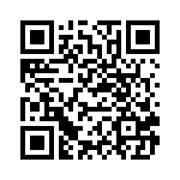

#intro:

purpose of this project is to create a tool that will "lock" or "protect" an existing image from strangers.  

##hypothesis:
if we sufficiently reduce quality of an image and introduce enough visual defects, then this image will only make
sense to the author or owner of the image.

##pseudo-algorithm:

1. degrade the original
    1. drop resolution e.g. > 10mpx image becomes 300x300 px
	1. introduce defects e.g. > punch holes in the image
	1. blurr the image e.g. gaussian
1. take original hi-res image and encrypt it e.g. aes
1. insert original encrypted image as payload of the new degraded image
    1. base64 encode and then stuff it in jpeg comment
	1. alternatively, append binary data in specially designated area of image format e.g. jpeg_eoi = (byte) 0xd9

#todo

- create encoding tools
    - "messed up images" with encrypted payload (in-progress)
	- image-to-ascii of the original image with encrypted base64 encoded original image as a tail of the image
- create decoding tools
    - decode at command or shell prompt
	- create html5 canvas viewer that will display encrypted payload
- have fun (in progress)

